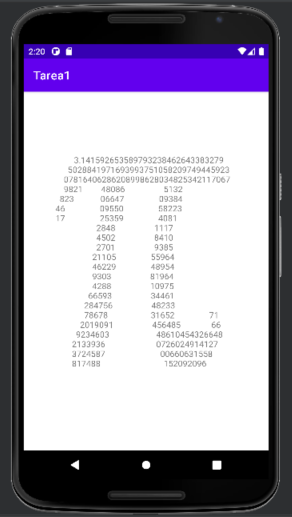

# Programación De Dispositivos Móviles 

> Descripcion general
Hacer un dibujo de caracteres en Android, mostrarlo en el layout de una actividad b asica, en vez de un "hola a todos". No es mostrar im ́agenes ni archivos gif, jpg, etc. Por ejemplo:

#### Entrega
Subir un archivo formato zip con nombre Tarea1 ApellidoParternoApellidoMaterno PDM2022-2 a la plataforma del curso. El archivo zip debe contener el proyecto completo.

#### Notas
El objetivo es probar el ambiente, emulador, programar y ver la estructura de una aplicaci ́on. Entregar la  carpeta completa del proyecto Android. La tarea es individual.

## Resultado

